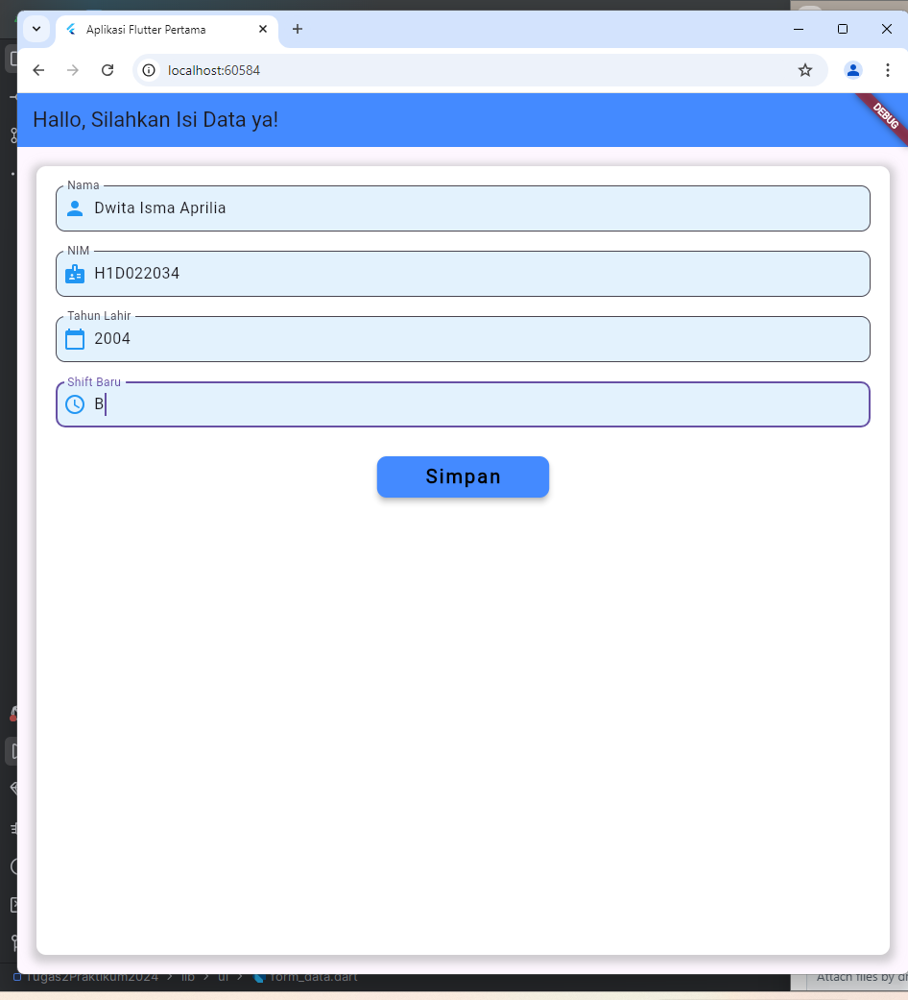
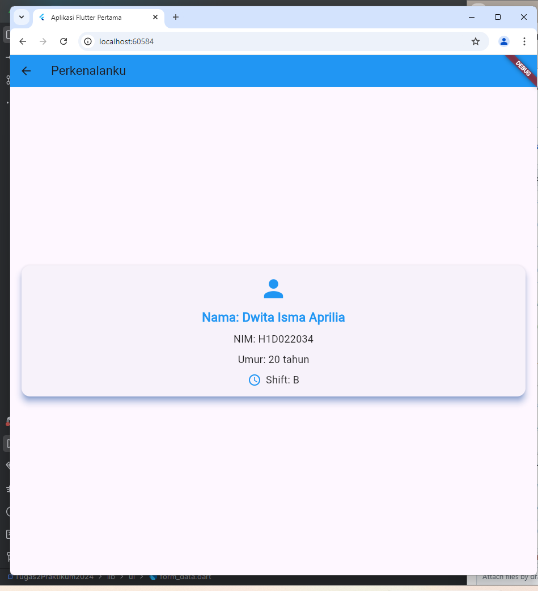

# Tugas Pertemuan 2
# Proses Passing Data dari Form ke Tampilan di Flutter

Deskripsi Aplikasi
Aplikasi ini menampilkan sebuah form input untuk **Nama**, **NIM**, **Tahun Lahir**, dan **Shif**. Setelah data diisi dan tombol **Simpan** ditekan, aplikasi akan menampilkan halaman kedua dengan data yang sudah diinput.

## 1. File `main.dart` 
File `main.dart` mendefinisikan widget utama aplikasi dan menetapkan `form_data.dart` sebagai halaman awal.

`runApp(const MyApp())` menjalankan aplikasi dengan widget `MyApp` sebagai root widget.

`MyApp` merupakan Widget utama yang mengembalikan `MaterialApp` dengan `FormData` sebagai halaman awal `(home)`.

## 2. File `form_data.dart`
File `form_data.dart` berisi form yang memungkinkan pengguna memasukkan data. Form ini memiliki beberapa `TextField` untuk input Nama, Nim, Tahun Lahir, dan Shift.

`TextEditingController` digunakan untuk mengontrol input pada `TextField`.

`_tombolSimpan()` : mengambil data dari `TextEditingController`, lalu menggunakan `Navigator` untuk berpindah halaman `TampilData`, sambil mem-passing data melalui konstruktor.

## 3. File `tampil_data.dart`
File `tampil_data.dart` menampilkan data yang dikirim dari halaman form.

Widget ini menerima data melalui konstruktor dan menampilkan informasi tersebut di halaman baru.

Data umut dihitung berdasarkan tahun saat ini dan tahun lahir yang diinputkan pengguna.

## Kesimpulan
1. `main.dart` : menjalankan aplikasi dan menetapkan 'FormData' sebagai halaman awal.
2. 'form_data.dart' : mengumpulkan data dari pengguna melalui form dan mengirimkan data tersebut ke halaman `TampilData` saat tombol disimpan ditekan.
3. `tampil_data.dart` : menampilkan data yang dikirim dari form di halaman baru.
   
Dengan proses ini, data yang diinputkan dalam form dapat diteruskan dan ditampilkan dihalaman lain menggunakan flutter.

## Screenshot

